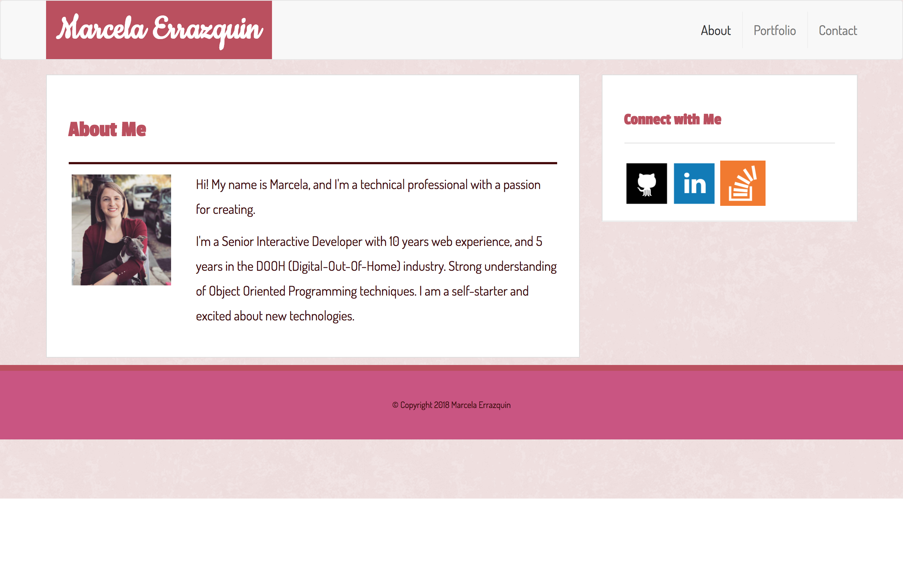
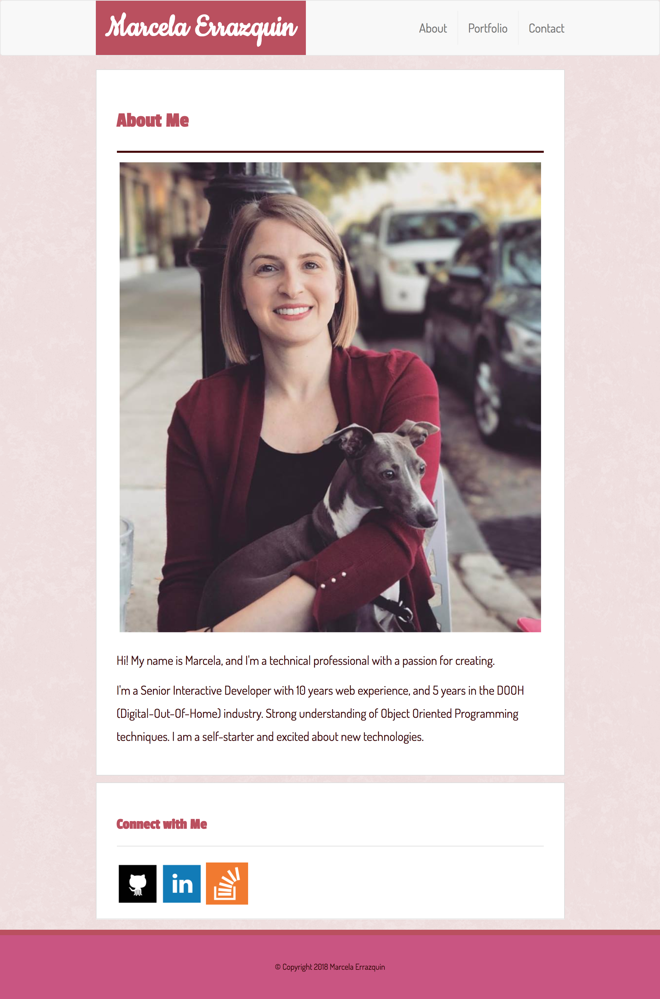
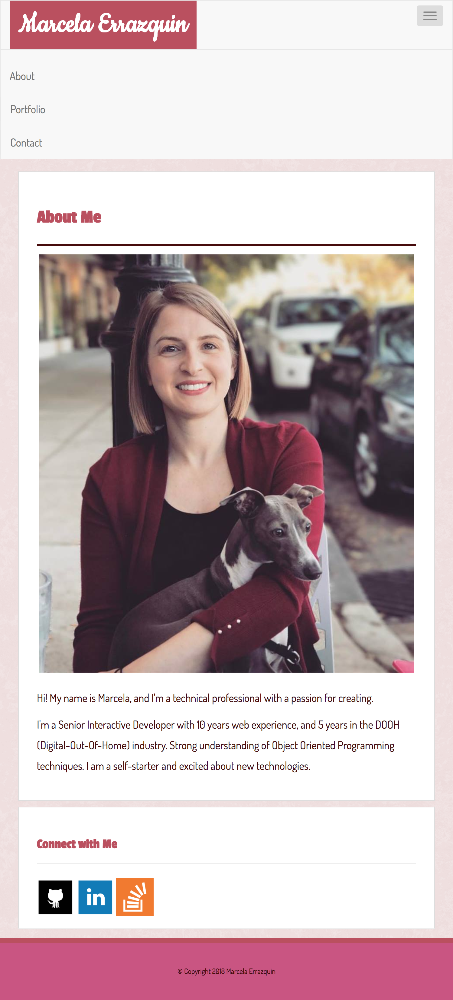

# Bootstrap-Portfolio

## Overview
For this project, I've re-created the simple portfolio done for the [Basic Portfolio](http://github.com/merrazquin/Basic_Portfolio) assignment using the Boostrap CSS framework

[Click here](http://merrazquin.github.io/Bootstrap-Portfolio) to launch this project in GitHub Pages

## Built with
* HTML
* CSS
* Bootstrap CSS Framework

## Bootstrap Components Used
* masthead - `.nav`, `.navbar-header`, `.navbar-brand`
* grid layout - `.container`, `.row`, `.col-[size]-*`
* contact form - `.form-group`, `.form-control`, `.btn`
* portfolio page - `.thumbnail`, `.img-responsive`

## Screenshots

 
